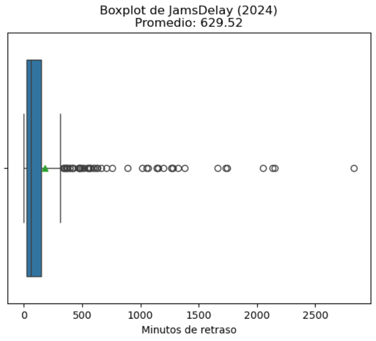
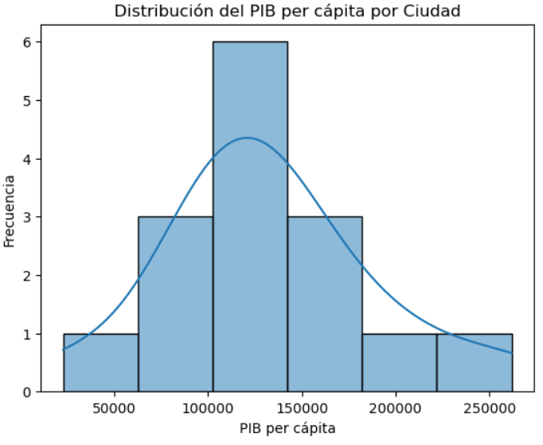

# Acerca de mí

**Economista especializada en Análisis de Datos** enfocada en la generación de insights accionables que impulsen la toma de decisiones estratégicas.

A lo largo de mi trayectoria académica, laboral y autodidacta, me he especializado en los procesos de extracción, limpieza y manipulación de datos. Mi objetivo no es solo descubrir patrones ocultos e insumos clave en la información, sino también traducirlos en narrativas visuales dinámicas e interactivas.

**¡Me apasiona contar historias a través de gráficas!**

### Habilidades tecnológicas
- Procesos ETL: **SQL / Python / Excel**
- Visualización de datos: **Power BI / Tableau**

### Habilidades blandas
Autodidacta | Trabajo en equipo | Atención a los detalles | Resolución de problemas | Organizada

# Proyectos autónomos

## Movilidad Urbana y Productividad Económica

### Descripción del proyecto
Este proyecto analiza la relación entre la movilidad urbana y la productividad económica en distintas ciudades del mundo, utilizando datos reales provenientes de fuentes públicas internacionales.

El objetivo fue integrar información de tráfico urbano —como niveles de congestión, tiempos de viaje y retrasos— con indicadores económicos —como PIB per cápita, desempleo y población— para identificar posibles patrones y relaciones entre ambas variables.

Las principales fuentes utilizadas fueron:
- **Movilidad urbana:** TomTom Traffic Index
- **Economía urbana:** OECD Cities

### Metodología
Para el desarrollo del proyecto se implementó un flujo de trabajo tipo ETL (Extract, Transform, Load) y EDA (Exploratory Data Analysis), realizando procesos de extracción, limpieza, transformación, integración y análisis de datos.

### Herramientas y tecnologías utilizadas
Python
Jupyter Notebook
pandas
numpy
matplotlib
seaborn

### Análisis visual

