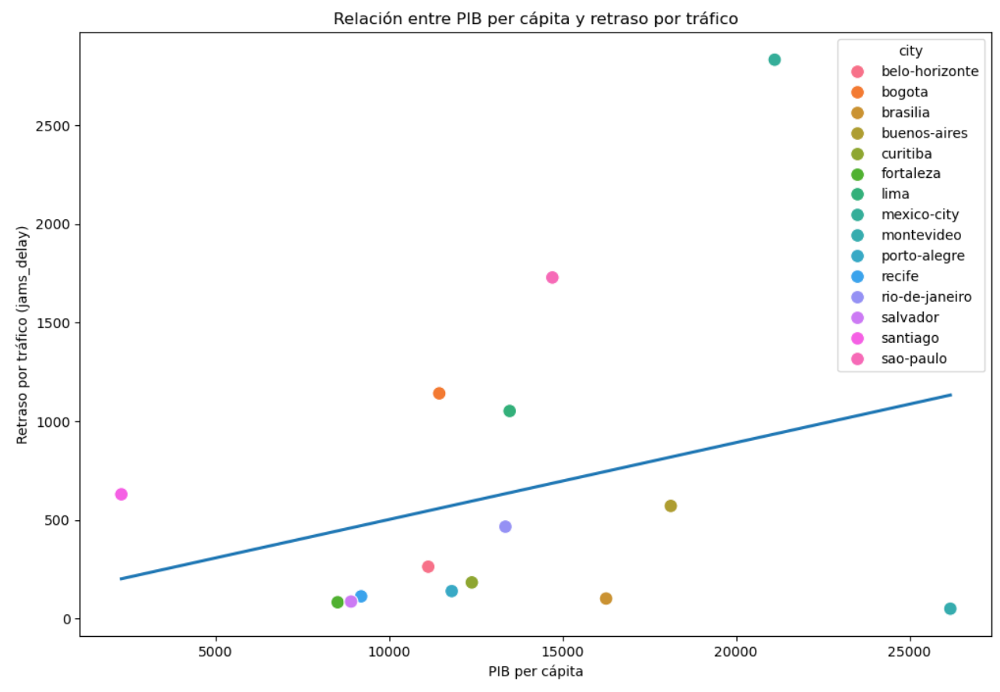
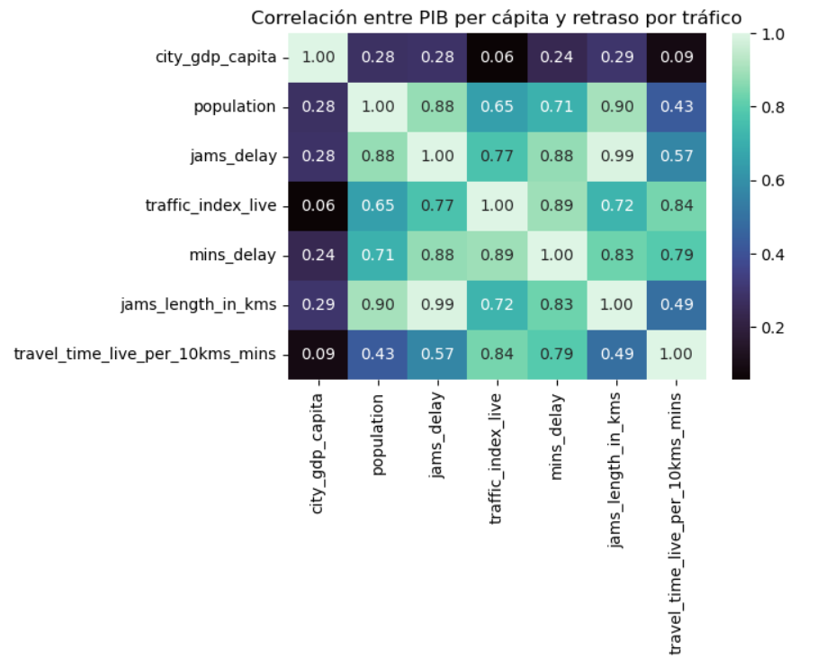

# Acerca de mí

**Economista especializada en Análisis de Datos** enfocada en la generación de insights accionables que impulsen la toma de decisiones estratégicas.

A lo largo de mi trayectoria académica, laboral y autodidacta, me he especializado en los procesos de extracción, limpieza y manipulación de datos. Mi objetivo no es solo descubrir patrones ocultos e insumos clave en la información, sino también traducirlos en narrativas visuales dinámicas e interactivas.

**¡Me apasiona contar historias a través de gráficas!**

### Habilidades tecnológicas
- Procesos ETL: **SQL / Python / Excel**
- Visualización de datos: **Power BI / Tableau**

### Habilidades blandas
Autodidacta | Trabajo en equipo | Atención a los detalles | Resolución de problemas | Organizada

# Proyectos autónomos

## 1. Movilidad Urbana y Productividad Económica

### Descripción del proyecto
Este proyecto analiza la relación entre la movilidad urbana y la productividad económica en distintas ciudades del mundo, utilizando datos reales provenientes de fuentes públicas internacionales.

El objetivo fue integrar información de tráfico urbano —como niveles de congestión, tiempos de viaje y retrasos— con indicadores económicos —como PIB per cápita, desempleo y población— para identificar posibles patrones y relaciones entre ambas variables.

Las principales fuentes utilizadas fueron:
- **Movilidad urbana:** TomTom Traffic Index
- **Economía urbana:** OECD Cities

### Metodología
Para el desarrollo del proyecto se implementó un flujo de trabajo tipo ETL (Extract, Transform, Load) y EDA (Exploratory Data Analysis), realizando procesos de extracción, limpieza, transformación, integración y análisis de datos.

### Herramientas y tecnologías utilizadas

### Análisis visual

#### Gráfica de dispersión  

La gráfica de dispersión o scatterplot muestra una relación positiva moderada entre el PIB per cápita o (`city_gdp_capita`) y el retraso por tráfico (`jams_delay`). Sin embargo, la amplia dispersión de los datos y la presencia de valores atípicos sugieren que el nivel económico no es suficiente para explicar las condiciones de movilidad urbana.

En ese sentido, los outliers visibles dicen algo interesante: algunas ciudades con altos niveles de PIB presentan congestión severa, como la Ciudad de México y en menor medida, Sao-Paulo, mientras que otras mantienen bajos niveles de tráfico y un PIB muy alto, como es el caso de Montevideo, lo que indica que factores como población, infraestructura y planeación urbana podrían tener una influencia más significativa.

#### Mapa de calor

En términos numéricos, la variable relacionada con el tamaño poblacional (`population`) muestran correlaciones más fuertes con los indicadores de congestión que la principal variable económica seleccionada, lo que indica que el tráfico urbano no parece ser el principal factor asociado al nivel económico.

### Conclusión del proyecto
- La relación entre movilidad urbana y productividad económica es positiva pero débil, lo que sugiere que existe una ligera tendencia a que ciudades con mayor PIB per cápita tengan también mayor congestión, pese a que la relación no es directa y mucho menos causal.
- Adicionalmente, por medio del presente ejercicio, se obvió que el nivel de tráfico se explica mediante algunas de las variables seleccionadas en el dataset tomtom_traffic similares a `jams_delay`, como se puede observar en el HeatMap. Sin embargo, el ejercicio abre un análisis alternativo interesante sobre otras posibles causas económicas que podrían estar afectando negativamente el congestionamiento vial.

### Recomendaciones
Debido a que el nivel de población está directamenre relacionado con la congestión vial y no al PIB per capital, el análisis del tráfico debe redirijirse hacia otras de sus posibles causas, como la infraestructura vial, el transporte público, la población, la inversión pública, que valen la pena considerar.
